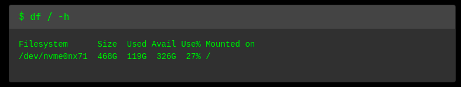

# Django Ubuntu System Administration (DUSA)

Django Ubuntu System Administration is a web application built on Django Web Framework. The web application provides web interface to manage and monitor Ubuntu server.

## Implementation (WIP)

### $ df / -h
Displays file system disk space usage.

